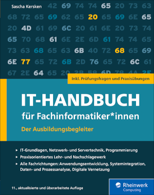

# IT-Handbuch für Fachinformatiker*innen
Alle Codebeispiele und Lösungen aus dem "IT-Handbuch für Fachinformatiker*innen"

[Zur vorigen Auflage](https://github.com/SaschaKersken/ITHandbuch10)

Hier finden Sie alle Codebeispiele sowie die meisten Lösungen der Übungsaufgaben und Kontrollfragen. 
Einige Lösungen folgen noch, denn sie werden mit ausführlichen Erläuterungen versehen.

[Webseite zum IT-Handbuch beim Rheinwerk Verlag](https://www.rheinwerk-verlag.de/it-handbuch-fur-fachinformatikerinnen_5728/)

[Errata](errata.md)

Informationen und Materialien (Listing, Lösungen) finden Sie auch [hier](https://www.rheinwerk-verlag.de/it-handbuch-fur-fachinformatikerinnen_5728/). Klicken Sie dort auf den Reiter "Materialien", um die Materialien zur aktuellen Auflage herunterzuladen, und auf den darunter befindlichen Link "Hier finden Sie die Materialien zu früheren Auflagen des Buches", um die Materialien zu früheren Auflagen zu erhalten.

Fragen, Anmerkungen oder Errata zum Buch bitte per E-Mail an [it-handbuch@sascha-kersken.de](mailto:it-handbuch@sascha-kersken.de). 
Und/oder folgen Sie [@ITHandbuch](https://twitter.com/ITHandbuch) auf Twitter.
