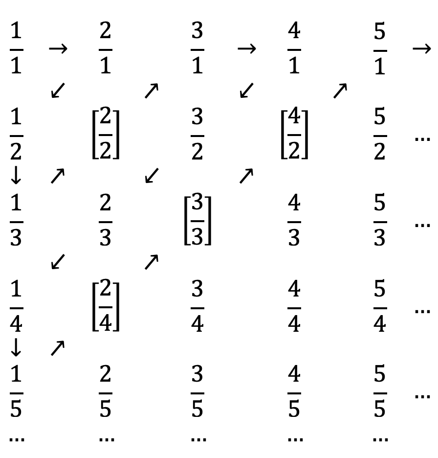

# Errata #
Fehler im Buch werden bei Bekanntwerden auf dieser Seite eingetragen.
## Im 1. korrigierten Nachdruck (Ende 2023) noch vorhanden ##

### S. 111, oben ###
Die Seite 110 unten gezeigte Matrix wird hier transponiert, dabei wird der ursprüngliche Eintrag -6 jedoch versehentlich 6. Korrekt muss es wie folgt lauten:

```
A^T = |-2  4 -6|
      | 3 -2  1|
```

### S. 117, Mitte ###
Beim zweiten Schritt ("Die zweite Zeile mit -1/2 multiplizieren") muss das Ergebnis beim dritten Eintrag in der zweiten Zeile der Matrix 3/2 statt -3/2 lauten. Im nächsten Schritt wird aber korrekt mit 3/2 weitergerechnet.

### S. 121, Mitte ###
Im ersten Lösungsschritt muss auf beiden Seiten der Gleichung 5 abgezogen werden, nicht hinzuaddiert. Dies zieht sich als Folgefehler durch die Lösung, die korrekt wie folgt lauten muss:

-2x + 5 = 0 | -5<br />
<=> -2x = -5 | :(-2)<br />
<=> x = 5/2

## Nur im Erstdruck (Juni 2023) ##

### S. 86, Abbildung 2.2 ###
In den Zeilen 4 und 5 sind die Nenner mancher Brüche falsch, da sie nicht 3 lauten dürfen, sondern durchgehend 4 beziehungsweise 5 sein sollen. Hier zur Veranschaulichung eine alternative und korrekte Fassung der Abbildung:



### S. 88, unter der Überschrift "2.2.3 Folgen und Reihen" ###
Statt "x<sub>1</sub>, 2, 3, 4, ..." muss es "x<sub>1</sub>, x<sub>2</sub>, x<sub>3</sub>, x<sub>4</sub>, ..." heißen.

## Selbst einen Fehler gefunden? ##
Bitte per E-Mail an [it-handbuch@sascha-kersken.de](mailto:it-handbuch@sascha-kersken.de). Vielen Dank!

[Zurück zur README](README.md)
